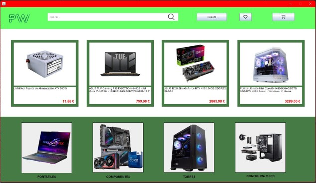
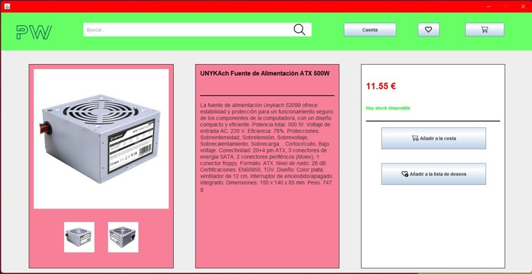
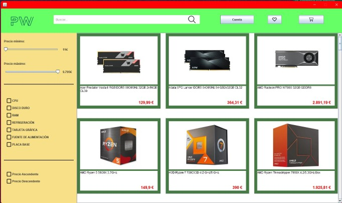

# 🖥️ PCWorld

Este proyecto es una simulación de una tienda online de productos informáticos. Está desarrollado en Java utilizando Swing para la interfaz gráfica. Permite a los usuarios navegar por productos, gestionar cuentas, hacer pedidos, configurar PCs a medida y contactar con soporte al cliente.

## ✨ Funcionalidades

- Registro y login de usuarios
- Gestión de cuenta personal y recuperación de contraseña
- Visualización y búsqueda de productos por categorías
- Añadir productos a la cesta o lista de deseos
- Configurador de PCs personalizado
- Gestión de pedidos realizados
- Envío de correos electrónicos (ej. códigos de verificación)
- Atención al cliente con ventana de chat
- Amplia gestión de errores gráficos

## 🧪 Tecnologías utilizadas

- Java SE 8+
- Java Swing (GUI)
- Apache Ant (`build.xml`)
- SMTP (JavaMail) para envío de correos

## ▶️ Ejecución del proyecto

### Requisitos

- JDK 8 o superior instalado
- NetBeans (recomendado) o cualquier IDE Java compatible

### Compilación y ejecución

1. Clona el repositorio:
   ```bash
   git clone https://github.com/DavidJaviLabs/PcWorld
   ```

2. Compila con Apache Ant:
   ```bash
   ant
   ```

3. Ejecuta la clase principal:
   ```bash
   java -cp dist/DescribanoaPcWorld.jar src.ClaseMainPcWorld
   ```

> Asegúrate de tener las imágenes en la carpeta `ImagenesDecoracion`, ya que muchas interfaces gráficas dependen de ellas. Además, deberás tener la base de datos configurada (`GuiasNecesarias`) y una cuenta de correo con una contraseña de aplicación habilitada para poder enviar los correos de verificación.

### Interfaz de la pagina principal


### Interfaz de producto


### Interfaz de productos


## 👥 Autores

Proyecto realizado por Javier Sáez García y David Escribano Arias.
